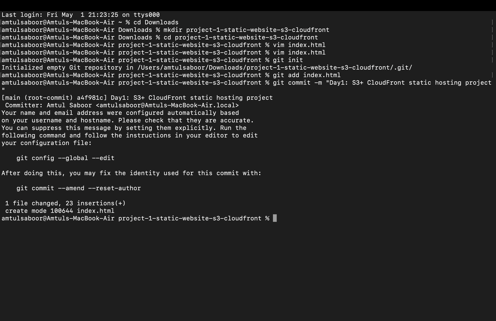
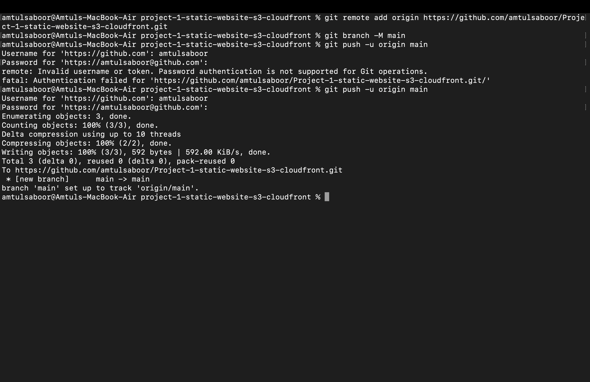
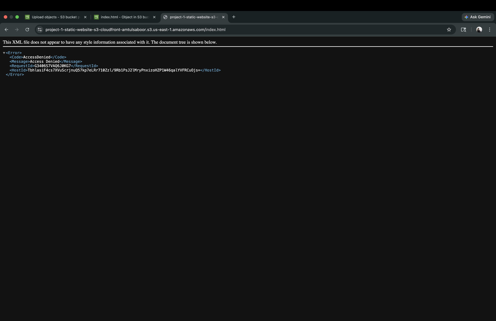
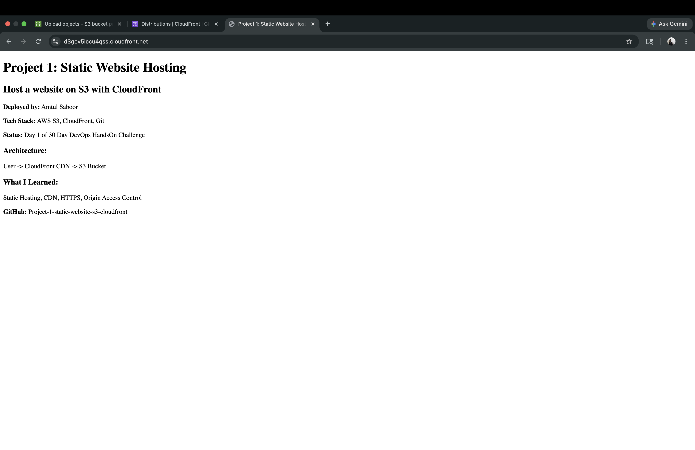

# Project 1: Static Website Hosting with AWS S3 + CloudFront

> Day 1 of 30 Day DevOps HandsOn Challenge  
> *Live URL:* https://d3gcv5lccu4qss.cloudfront.net/
> *GitHub Repo:* https://github.com/amtulsaboor/Project-1-static-website-s3-cloudfront

## 📋 Project Overview
This project demonstrates hosting a secure, production-grade static website on AWS. Amazon S3 stores the files privately, and CloudFront distributes them globally over HTTPS using Origin Access Control (OAC). The bucket is never public, following AWS Well-Architected security best practices.

## 🛠️ Tech Stack
- *AWS S3* - Private object storage for static assets
- *AWS CloudFront* - Global CDN with edge caching and free TLS
- *Origin Access Control (OAC)* - IAM-based secure access from CloudFront to S3
- *Git* - Version control for source code and documentation
- *GitHub* - Remote repository and project portfolio

## 🏗️ Architecture Diagram
Internet User
     ↓ HTTPS
CloudFront Distribution (d3grv3lzzu4qgs.cloudfront.net)
     ↓ OAC (Signed Requests Only)
S3 Bucket (project-1-static-website-s3-cloudfront-amtulsaboor)
[Block All Public Access: ON]
## 🚀 Complete Deployment Steps with All Commands

### Step 1: Create Project Folder and http://index.html
1. Open Terminal
2. Create project directory and navigate into it:
mkdir project-1-static-website-s3-cloudfront
cd project-1-static-website-s3-cloudfront
3. Create `index.html` file:
touch index.html
4. Open `index.html` in a text editor and add basic HTML
5. Save the file.

### Step 2: Initialize Git and First Commit
1. Initialize local git repository:
git init
2. Add `index.html` to staging:
git add index.html
3. Commit with message:
git commit -m "Day1: S3+CloudFront static hosting project"

### Step 3: Create GitHub Repository and Push Code
1. Create new public repository on GitHub named: `Project-1-static-website-s3-cloudfront`
2. Do not initialize with README, .gitignore, or license
3. Copy the HTTPS URL: `https://github.com/amtulsaboor/Project-1-static-website-s3-cloudfront.git`
4. In terminal, link local repo to GitHub:
git remote add origin https://github.com/amtulsaboor/Project-1-static-website-s3-cloudfront.git
5. Rename branch to main:
git branch -M main
6. Push code to GitHub. Use Personal Access Token when prompted for password:
git push -u origin main

### Step 4: Create Private S3 Bucket
1. Log in to AWS Console → Navigate to S3
2. Click `Create bucket`
3. *Bucket name:* `project-1-static-website-s3-cloudfront-amtulsaboor`
4. *AWS Region:* `US East (N. Virginia) us-east-1`
5. *Object Ownership:* ACLs disabled (recommended)
6. *Block Public Access settings:* Check `Block all public access`. Keep all 4 boxes checked.
7. *Bucket Versioning:* Disable
8. Click `Create bucket`
9. Click into the bucket → `Upload` → `Add files` → Select `index.html` → `Upload`

### Step 5: Verify S3 Bucket is Private
1. Click on `index.html` inside the bucket
2. Copy the `Object URL`: `https://project-1-static-website-s3-cloudfront-amtulsaboor.s3.us-east-1.amazonaws.com/index.html`
3. Open URL in browser or Incognito window
4. *Expected result:* XML error page with `<Code>AccessDenied</Code>`
5. This confirms the bucket is private and not publicly accessible

### Step 6: Create CloudFront Distribution with OAC
1. Navigate to CloudFront → `Create distribution`
2. *Origin domain:* Click field and select `project-1-static-website-s3-cloudfront-amtulsaboor.s3.us-east-1.amazonaws.com`
3. *Origin path:* Leave empty
4. *Name:* `project-1-static-website-s3-cloudfront-amtulsaboor.s3.us-east-1.amazonaws.com`
5. *Origin access:* Select `Origin access control settings (recommended)`
6. *Origin access control:* Click `Create control setting` → Use default name → `Create`
7. A yellow banner appears: `You must update the S3 bucket policy`. Click `Copy policy`
8. *Do NOT edit Default root object yet* due to console bug. Leave it empty.
9. *Default cache behavior:* `Redirect HTTP to HTTPS` should be selected
10. *Web Application Firewall:* `Do not enable security protections`
11. Click `Create distribution`
12. Go back to S3 bucket → `Permissions` tab → `Bucket policy` → `Edit` → Paste policy → `Save changes`

### Step 7: Fix Default Root Object After Deployment
1. Wait 2-3 minutes for distribution Status to change from `Deploying` to `Enabled`
2. In CloudFront → Click on Distribution ID `E2HYHPWXX80AZL`
3. Go to `General` tab → Click `Edit` in Settings section
4. *Default root object:* Type `index.html`
5. Click `Save changes`
6. Wait 5-10 minutes for Status to show `Deploying` then back to `Enabled`
7. Copy `Distribution domain name`: `d3grv3lzzu4qgs.cloudfront.net`

### Step 8: Test Live Website
1. Open `https://d3grv3lzzu4qgs.cloudfront.net` in browser
2. *Expected result:* Your `index.html` content loads with HTTPS lock icon
3. If you see `403 Forbidden`, wait 3 more minutes and hard refresh: `Ctrl + Shift + R` or `Cmd + Shift + R`

### Step 9: Push Screenshots and README to GitHub
1. Save 4 screenshots as `1.png`, `2.png`, `3.png`, `4.png` in project folder
2. Stage all images:
git add 1.png 2.png 3.png 4.png
3. Commit images:
git commit -m "add project screenshots"
4. Push to GitHub:
git push
5. Create `README.md` with this file content
6. Stage and push README:
git add README.md
git commit -m "add detailed readme"
git push
## ✅ Final Result
*Live Website:* https://d3grv3lzzu4qgs.cloudfront.net  
*Status:* Enabled, HTTPS active, globally cached via CloudFront edge locations  
*Security:* S3 bucket private, accessible only through CloudFront OAC

## 💡 Key Concepts Learned
| **Concept** | **Command/Setting** | **Why It Matters** |
| **S3 Block Public Access** | `Block all public access: ON` | Prevents data leaks. Bucket stays private by default |
| **Origin Access Control** | `Origin access control settings` | Replaces legacy OAI. Uses IAM to allow only CloudFront to read S3 |
| **Default Root Object** | `index.html` in General settings | CloudFront serves `index.html` when user visits `/`. Without it: 403 error |
| **Git Authentication** | `git push` with Personal Access Token | GitHub deprecated password auth. PAT required for HTTPS |
| **CloudFront Cache** | Wait 5-10 min after changes | Changes propagate to 400+ edge locations. `x-cache: Hit from cloudfront` header confirms cache |
## 🐛 Troubleshooting Guide
1. *`AccessDenied` from S3 URL:* This is correct. It proves your bucket is private. Never make S3 public.
2. *`403 Forbidden` from CloudFront URL:* Cause: `Default root object` not set. Fix: Edit distribution → General → Set to `index.html` → Wait 10 min.
3. *CloudFront wizard loops to Step 2 on Edit:* Known AWS Console bug May 2026. Workaround: Create distribution first, then edit `Default root object` after Status = `Enabled`.
4. *`git push` asks for password:* Use GitHub Personal Access Token, not your account password. Generate at GitHub → Settings → Developer settings → Tokens.
5. *GitHub UI "something went wrong" on upload:* Use terminal: `git add .` → `git commit -m "message"` → `git push`

## 📁 Final Project Structure
project-1-static-website-s3-cloudfront/
├── index.html
├── README.md
├── 1.png
├── 2.png
├── 3.png
└── 4.png
## 🔗 Project Links
- *Live Site:* https://d3grv3lzzu4qgs.cloudfront.net
- *Source Code:* https://github.com/amtulsaboor/Project-1-static-website-s3-cloudfront

---
*Deployed by:* Amtul Saboor  
*Date:* May 2, 2026  
*Challenge:* 30 Day DevOps HandsOn - Day 1 Complete ‎<This message was edited>
